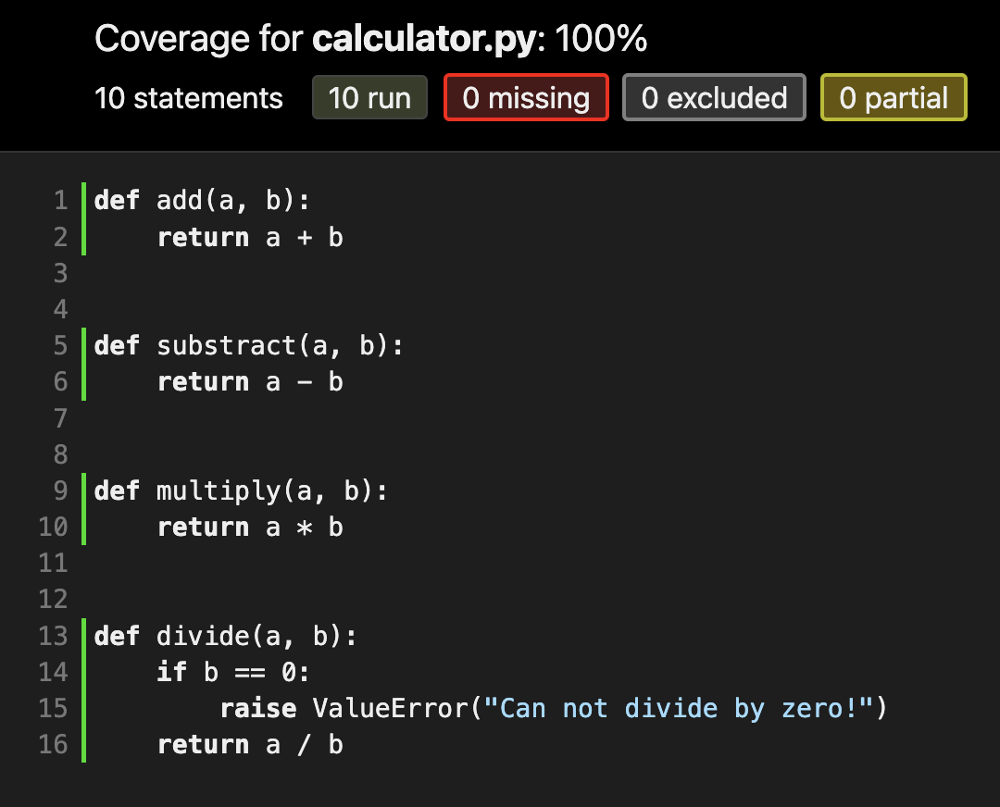
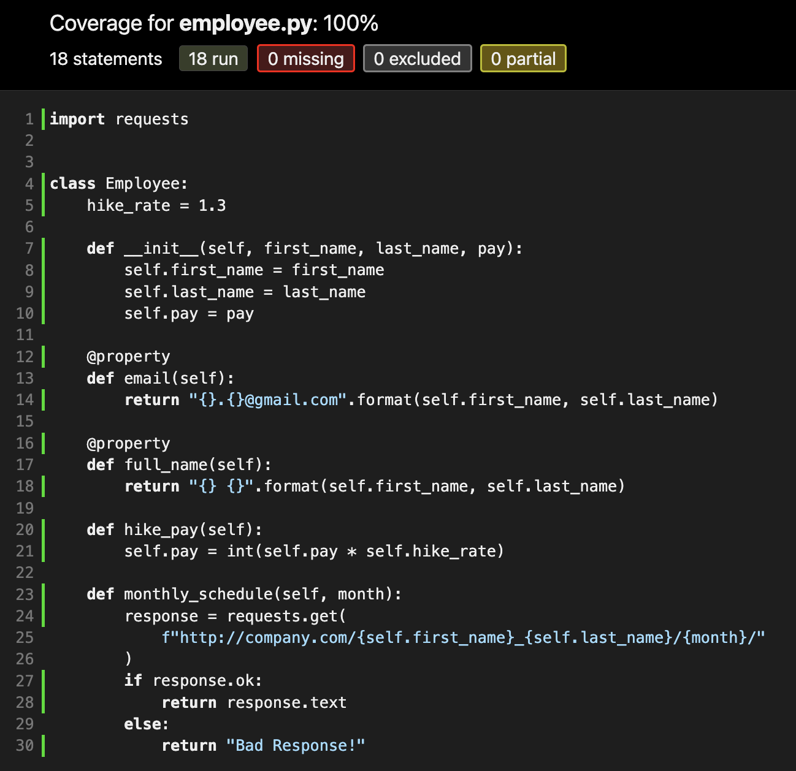

# unittest_module

Python unittest framework.

## Requirements

- Python 3.6

## Commands

- NOTE: create \_\_init\_\_.py file in all the folders where unittest files are kept. Only then unittest module will identify unittest files and unittest cases.
- python test_calculator.py
- python test_employee.py
- coverage run -m unittest discover -vv
- coverage report --show-missing
- coverage html
- python code_coverage_runner.py

## Test Coverage Report (code_coverage_runner.py)

- 
- 

## Notes

- Functional test cases for microservice REST API development:
  - functional test cases involves 3 test cases:
    - Unit testing: Here we test particular unit/module/function in isolation. If that function has any dependency on other function, we will stub/mock it.
    - Integration testing: Here we integrate every component one by one (Different functions, DBs, other microservices, etc.) and test the functionality (API request and response testing - kinda black box testing.)
    - End-to-end testing: A type of software testing used to test whether the flow of a software from initial stage to final stage is behaving as expected.

## References

- [Coverage.py](https://coverage.readthedocs.io/en/6.3.1/)
- [realpython/discover-flask](https://github.com/realpython/discover-flask/blob/master/manage.py)
